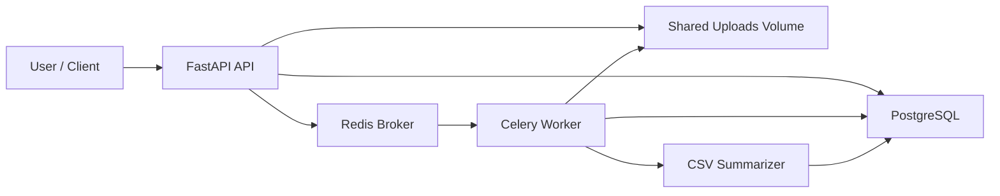

# csv-job-platform

FastAPI backend for authenticated CSV uploads, asynchronous job processing, and CSV summarization results.

## Overview

This project lets a user:

- register and log in
- upload a CSV file
- submit a `summarize` job for that file
- track job status
- fetch the completed summary result

The stack uses:

- FastAPI for the API
- PostgreSQL for persistent state
- Redis as the Celery broker
- Celery for background job execution
- local disk for uploaded file storage

## Architecture



## Project layout

```text
csv-job-platform/
├── app/
│   ├── api/
│   │   └── routes/
│   ├── core/
│   ├── db/
│   ├── models/
│   ├── processors/
│   ├── schemas/
│   ├── services/
│   └── tasks/
├── alembic/
├── docker/
├── scripts/
├── tests/
├── .env.example
├── .github/
├── .gitignore
├── Dockerfile
├── docker-compose.yml
├── pyproject.toml
└── requirements.txt
```

## Local setup

### One-command Docker setup

Run the full stack:

```bash
docker compose up --build
```

This starts:

- API on `http://localhost:8000`
- Celery worker
- PostgreSQL
- Redis

The API and worker use the same app image and share the same uploads volume so background jobs can read files uploaded by the API.

### Local Python setup

1. Create and activate a virtual environment.
2. Install dependencies:

```bash
pip install -r requirements.txt
```

3. Copy the environment template:

```bash
cp .env.example .env
```

4. Start backing services:

```bash
docker compose up -d postgres redis
```

5. Apply migrations:

```bash
alembic upgrade head
```

6. Run the API:

```bash
uvicorn app.main:app --reload
```

7. Run the worker in a second terminal:

```bash
celery -A app.tasks.celery_app.celery_app worker --loglevel=info
```

## Environment variables

The app loads settings from environment variables and `.env` using `pydantic-settings`.

- `APP_NAME`: application title
- `APP_ENV`: environment name
- `APP_DEBUG`: FastAPI debug mode
- `API_PREFIX`: API route prefix
- `HOST`: bind address
- `PORT`: API port
- `DATABASE_URL`: PostgreSQL connection string
- `UPLOAD_DIR`: local upload directory
- `MAX_UPLOAD_SIZE_BYTES`: max upload size
- `REDIS_URL`: Redis URL
- `CELERY_BROKER_URL`: Celery broker URL
- `CELERY_RESULT_BACKEND`: Celery result backend URL

## Job lifecycle

The current job lifecycle is:

1. User uploads a CSV file.
2. User submits a `summarize` job for a file they own.
3. API creates the job row in PostgreSQL with status `QUEUED`.
4. API enqueues the job into Redis through Celery.
5. Worker loads the job from PostgreSQL.
6. Worker marks the job `PROCESSING`.
7. Worker reads the uploaded CSV from shared storage.
8. Worker runs the summarizer.
9. Worker writes a `JobResult` row in PostgreSQL.
10. Worker marks the job `COMPLETED`.

If processing fails:

- the worker marks the job `FAILED`
- the worker stores the error message on the job row

## API endpoints

- `GET /` returns app metadata
- `GET /api/health` returns a health check
- `POST /api/auth/register` creates a user
- `POST /api/auth/login` returns a bearer token
- `GET /api/auth/me` returns the current user
- `POST /api/files` uploads a CSV for the authenticated user
- `POST /api/jobs` creates a `summarize` job for an owned file
- `GET /api/jobs` returns the current user's paginated jobs
- `GET /api/jobs/{job_id}` returns job status
- `GET /api/jobs/{job_id}/result` returns job result

## Demo

This is the basic happy-path workflow.

### 1. Register

```bash
curl -X POST http://127.0.0.1:8000/api/auth/register \
  -H "Content-Type: application/json" \
  -d '{"email":"user@example.com","password":"supersecret"}'
```

### 2. Login

```bash
curl -X POST http://127.0.0.1:8000/api/auth/login \
  -H "Content-Type: application/json" \
  -d '{"email":"user@example.com","password":"supersecret"}'
```

Example response:

```json
{
  "access_token": "<token>",
  "token_type": "bearer"
}
```

Set your token:

```bash
export TOKEN="<token>"
```

### 3. Upload CSV

```bash
curl -X POST http://127.0.0.1:8000/api/files \
  -H "Authorization: Bearer $TOKEN" \
  -F "upload=@sample.csv;type=text/csv"
```

Example response:

```json
{
  "id": 1,
  "user_id": 1,
  "original_filename": "sample.csv",
  "stored_path": "uploads/abc123_sample.csv",
  "size_bytes": 128,
  "uploaded_at": "2026-03-30T12:00:00Z"
}
```

Set your file id:

```bash
export FILE_ID=1
```

### 4. Submit summarize job

```bash
curl -X POST http://127.0.0.1:8000/api/jobs \
  -H "Authorization: Bearer $TOKEN" \
  -H "Content-Type: application/json" \
  -d "{\"file_id\": $FILE_ID, \"job_type\": \"summarize\"}"
```

Example response:

```json
{
  "id": 10,
  "user_id": 1,
  "file_id": 1,
  "job_type": "summarize",
  "status": "QUEUED",
  "attempt_count": 0,
  "error_message": null,
  "created_at": "2026-03-30T12:01:00Z",
  "started_at": null,
  "completed_at": null
}
```

Set your job id:

```bash
export JOB_ID=10
```

### 5. Poll status

```bash
curl http://127.0.0.1:8000/api/jobs/$JOB_ID \
  -H "Authorization: Bearer $TOKEN"
```

Example response:

```json
{
  "job_id": 10,
  "job_type": "summarize",
  "status": "COMPLETED",
  "created_at": "2026-03-30T12:01:00Z",
  "started_at": "2026-03-30T12:01:01Z",
  "completed_at": "2026-03-30T12:01:02Z"
}
```

### 6. Fetch result

```bash
curl http://127.0.0.1:8000/api/jobs/$JOB_ID/result \
  -H "Authorization: Bearer $TOKEN"
```

Example response:

```json
{
  "job_id": 10,
  "result": {
    "row_count": 100,
    "column_count": 4,
    "columns": ["id", "name", "age", "city"],
    "null_counts": {
      "id": 0,
      "name": 2,
      "age": 5,
      "city": 1
    }
  }
}
```

## More API examples

### Get current user

```bash
curl http://127.0.0.1:8000/api/auth/me \
  -H "Authorization: Bearer $TOKEN"
```

### List jobs

```bash
curl "http://127.0.0.1:8000/api/jobs?page=1&page_size=10" \
  -H "Authorization: Bearer $TOKEN"
```

### Upload rejection example

```bash
curl -X POST http://127.0.0.1:8000/api/files \
  -H "Authorization: Bearer $TOKEN" \
  -F "upload=@notes.txt;type=text/plain"
```

## Tradeoffs

### PostgreSQL as source of truth

PostgreSQL is the system of record for users, files, jobs, and results.

Pros:

- durable and transactional
- easy to query job history and ownership
- good fit for relational state and API reads

Cons:

- more coordination than an all-in-memory queue model
- worker code must carefully keep job status and result writes consistent

### Redis as broker

Redis is used as the Celery broker and result backend, not as the system of record.

Pros:

- fast queueing
- simple Celery integration
- good operational fit for background jobs

Cons:

- ephemeral compared with PostgreSQL
- should not be treated as the canonical place to read business state

### Local disk now, S3 later

Uploaded files are stored on shared local disk today.

Pros:

- simple to implement
- easy to debug locally
- works well for a single-node deployment or Docker volume setup

Cons:

- not ideal for horizontal scaling
- shared-disk assumptions break down across multiple hosts
- long-term production storage is better served by object storage such as S3

The natural next step is to replace `UPLOAD_DIR` storage with S3 while keeping PostgreSQL as the metadata source of truth.

## Running tests

The integration tests use `pytest`, `httpx`, a dedicated PostgreSQL test database, and mocked Celery enqueueing.

Start PostgreSQL first:

```bash
docker compose up -d postgres
```

Run the test suite:

```bash
pytest tests/test_workflows.py -q
```

If you are using the project virtualenv directly:

```bash
.venv/bin/pytest tests/test_workflows.py -q
```

## Docker volumes

- `uploads_data`: shared file storage used by both API and worker
- `postgres_data`: PostgreSQL data persistence
